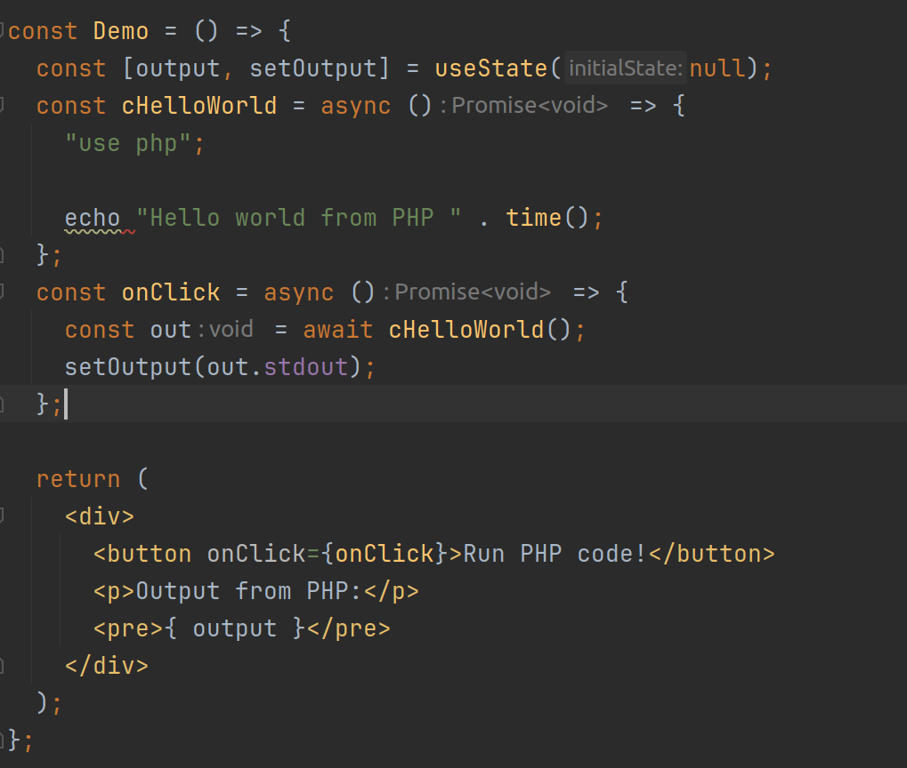

# React `use php`

Use PHP in your React!

Demo:
https://github.com/memegento/react-use-php/assets/110774840/c85cf69c-e800-4759-854e-0c9de2c1bf2e

## TODO

- [ ] Add xDebug support
- [ ] Add syntax highlighting
- [ ] Add more folders and files with code that does nothing to look more professional
- [ ] Create `create-react-use-php` package cuz this ecosystem is broken
- [ ] Add typescript support
- [ ] Make somebody else figure out publishing this to npm (I am still not over it)
- [ ] Remove typescript support
- [ ] Tell windows ppl to just use WSL
- [ ] esbuild is not cursed enough, gotta switch to something else

## Credits
https://github.com/elnardu/react-use-c
